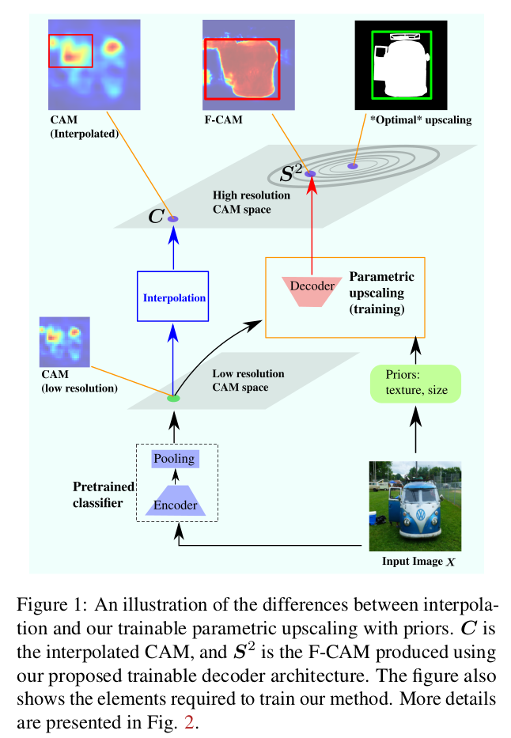
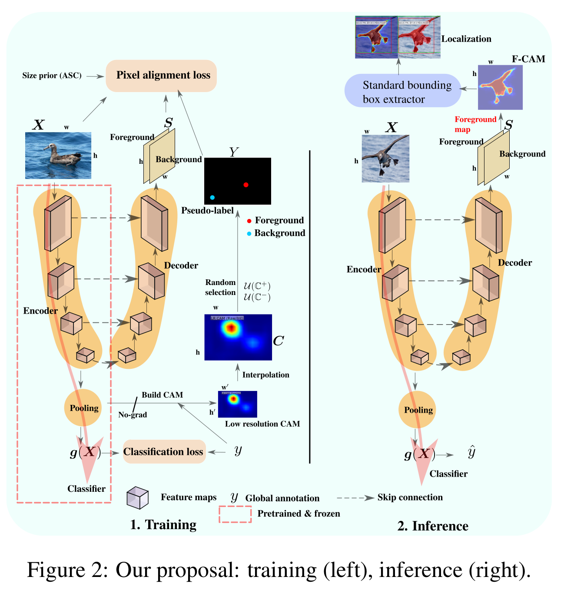
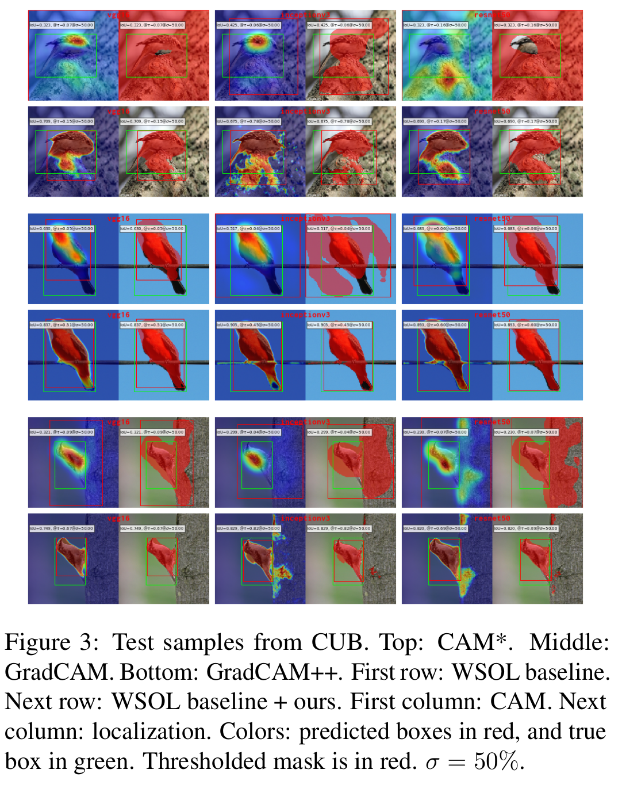
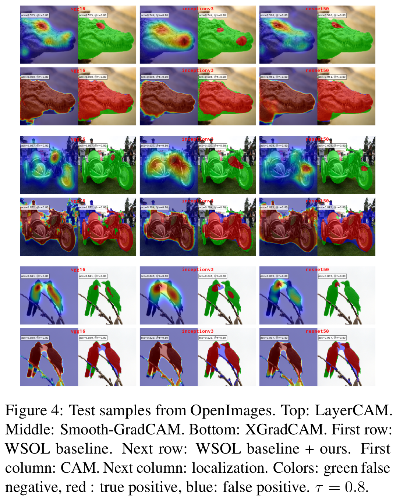
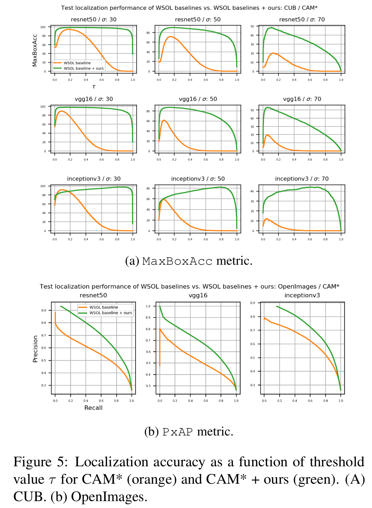
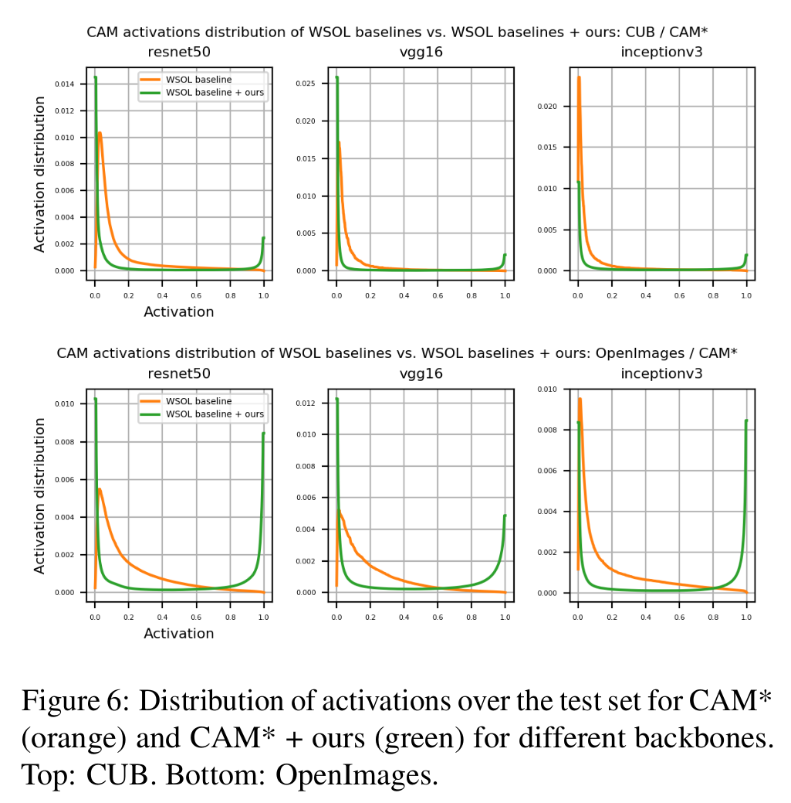

### Pytorch 1.9.0 code for:
`F-CAM: Full Resolution Class Activation Maps via Guided Parametric Upscaling` ([https://arxiv.
org/abs/2109.07069](https://arxiv.org/abs/2109.07069))

### WACV 2022: [[Slides]](/doc/wacv-2022-fcam-slides.pdf)  [[Video presentation]](https://drive.google.com/file/d/1UO7JfouETioBOp753xERnagjGIXFs5bO/view?usp=sharing)  [[Poster]](/doc/1177-wacv-poster.pdf)

### Citation:
```
@InProceedings{belharbi2022fcam,
  title={F-CAM: Full Resolution Class Activation Maps via Guided Parametric Upscaling},
  author={Belharbi, S. and Sarraf, A. and Pedersoli, M. and Ben Ayed, I. and McCaffrey, L. and Granger, E.},
  booktitle = {WACV},
  year={2022}
}
```


### Issues:
Please create a github issue.


### Content:
* [Requirements](#re2q)
* [Datasets](#datasets)
* [Run code](#run)
* [Method](#method)
* [Results](#results)

#### <a name='reqs'> Requirements</a>:

* Python 3.7.10
* [Pytorch](https://github.com/pytorch/pytorch)  1.9.0
* [torchvision](https://github.com/pytorch/vision) 0.10.0
* [Full dependencies](dependencies/requirements.txt)
* Build and install CRF:
    * Install [Swig](http://www.swig.org/index.php)
    * CRF
```shell
cd dlib/crf/crfwrapper/bilateralfilter
swig -python -c++ bilateralfilter.i
python setup.py install
```

#### <a name="datasets"> Download datasets </a>:
See [folds/wsol-done-right-splits/dataset-scripts](
folds/wsol-done-right-splits/dataset-scripts). For more details, see
[wsol-done-right](https://github.com/clovaai/wsolevaluation) repo.

Once you download the datasets, you need to adjust the paths in
[get_root_wsol_dataset()](dlib/configure/config.py).

#### <a name="datasets"> Run code </a>:

* WSOL baselines: CAM over CUB using ResNet50:
```shell
time python main_wsol.py --task STD_CL \
                         --encoder_name resnet50 \
                         --arch STDClassifier \
                         --opt__name_optimizer sgd \
                         --batch_size 32 \
                         --opt__step_size 15 \
                         --opt__gamma 0.1 \
                         --max_epochs 50 \
                         --freeze_cl False \
                         --support_background True \
                         --method CAM \
                         --spatial_pooling WGAP \
                         --dataset CUB \
                         --box_v2_metric False \
                         --cudaid $cudaid \
                         --debug_subfolder None \
                         --opt__lr 0.0017 \
                         --exp_id 08_19_2021_14_05_20_620912__6229687
```

* Once you trained a WSOL baseline, copy the best model from the exp folder
  into the folder [./pretrained](./pretrained). The best model is located in
  a folder with the form name
  `CUB-resnet50-CAM-WGAP-cp_best-boxv2_False`. Copy the whole folder.
* F-CAM: to train with F-CAM, a pretrained WSOL model needs to be prepared
  as in the previous step. Run for training with F-CAM:
 ```shell
time python main_wsol.py --task F_CL \
                         --encoder_name resnet50 \
                         --arch UnetFCAM \
                         --opt__name_optimizer sgd \
                         --batch_size 32 \
                         --eval_checkpoint_type best \
                         --opt__step_size 1000 \
                         --opt__gamma 0.1 \
                         --max_epochs 50 \
                         --freeze_cl True \
                         --support_background True \
                         --method CAM \
                         --spatial_pooling WGAP \
                         --dataset CUB \
                         --box_v2_metric False \
                         --cudaid $cudaid \
                         --debug_subfolder None \
                         --opt__lr 0.01 \
                         --elb_init_t 1.0 \
                         --elb_max_t 10.0 \
                         --elb_mulcoef 1.01 \
                         --sl_fc True \
                         --sl_fc_lambda 1.0 \
                         --sl_start_ep 0 \
                         --sl_end_ep -1 \
                         --sl_min 1 \
                         --sl_max 1 \
                         --sl_ksz 3 \
                         --sl_min_p 0.1 \
                         --sl_fg_erode_k 11 \
                         --sl_fg_erode_iter 1 \
                         --crf_fc True \
                         --crf_lambda 2e-09 \
                         --crf_sigma_rgb 15.0 \
                         --crf_sigma_xy 100.0 \
                         --crf_scale 1.0 \
                         --crf_start_ep 0 \
                         --crf_end_ep -1 \
                         --max_sizepos_fc True \
                         --max_sizepos_fc_lambda 0.1 \
                         --max_sizepos_fc_start_ep 0 \
                         --max_sizepos_fc_end_ep -1 \
                         --entropy_fc False \
                         --exp_id 08_19_2021_14_09_48_915565__1492324
```

#### <a name='method'> Method</a>:





#### <a name='results'> Results</a>:








